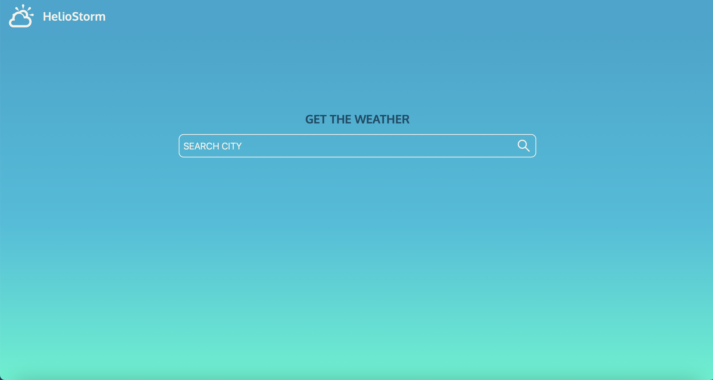
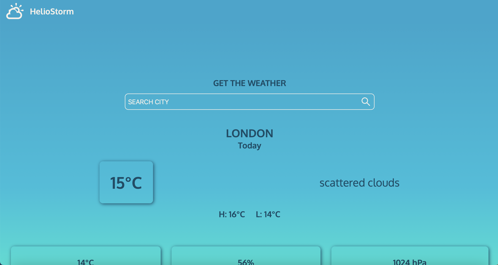
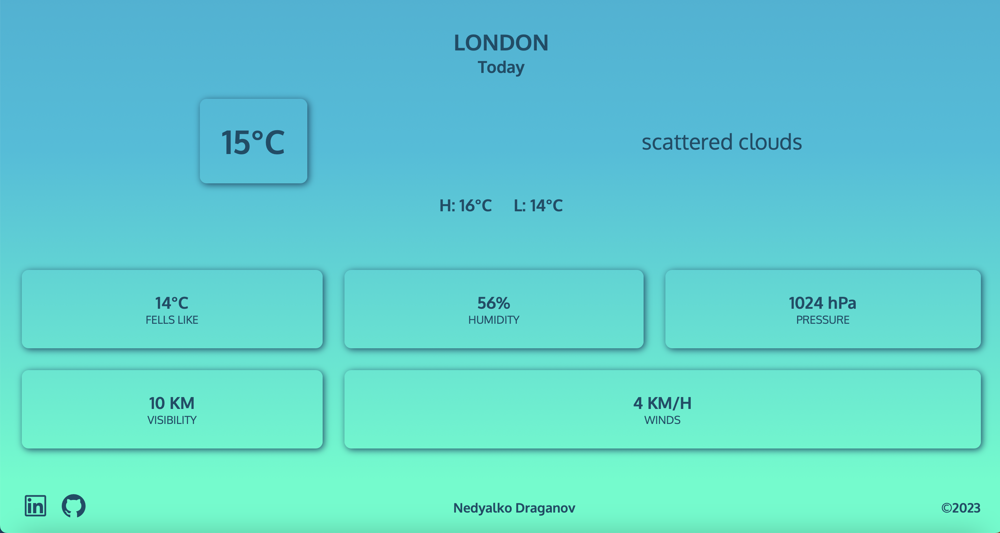
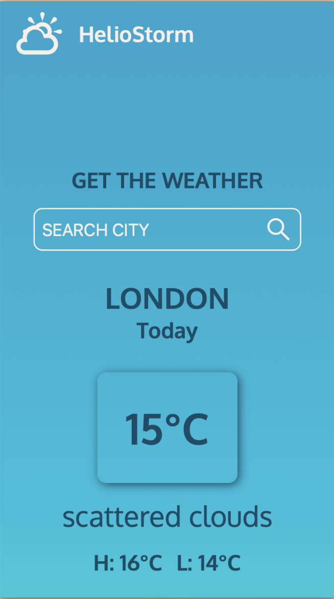
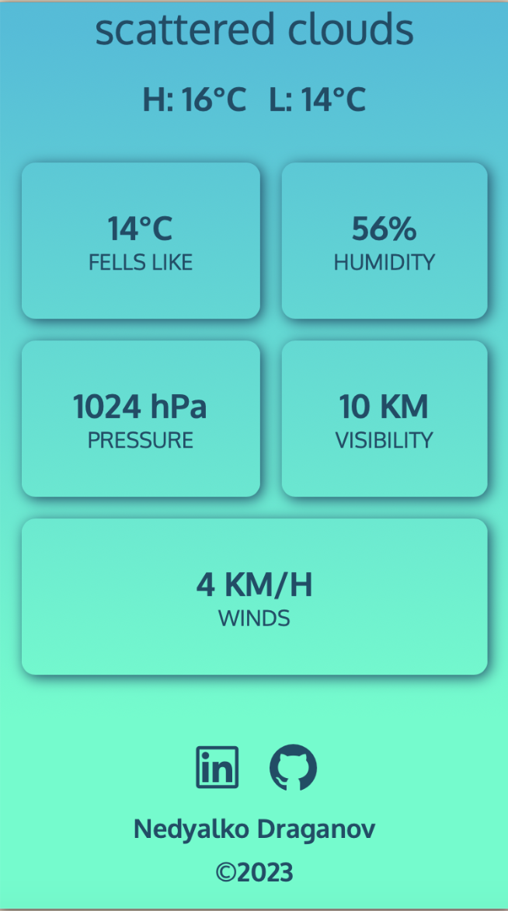

# HelioStorm

HelioStorm is a weather app website displaying the basic parameters for the chosen city in the current moment.

## Overview

### Features

#### Layout

- Header with logo and title
- Main page
- Footer with my social media links, my name and the current year

#### Pages and components

- One-page website
- Initially loaded the page displaying a search bar for the city
- While awaiting to fetch the data, displaying "LOADING..."
- After fetching the data, display the weather component with the parameters of the chosen city below

### Screenshots








### Links

[Live site](https://weather-app-taupe.vercel.app)
[Source code](https://github.com/NDraganov/weather-app)

## Development

### Built with

- Next.js
- Axios for helping me with the fetching data
- Open Weather Map API key
- CSS with the grid and the flex
- React icons

### What I've learned

With this project, I learn how to use “Axios” to fetch the data with a promise

```js
const fetchWeatherData = async (e) => {
  e.preventDefault();
  setLoading(true);
  const response = await axios
    .get(weatherURL)
    .then((response) => {
      setWeather(response.data);
    })
    .catch((error) => {
      console.log(error);
    });
  setCity("");
  setLoading(false);
};
```

### Errors/Bugs

When I deployed my project and tried to enter a city, the console threw me an error: "Axios: BadRequest; code 401" with the Open Weather Map Unauthorized API key. The API key in the URL was "undefined".

I thought my environmental variable code was wrong because if the key was hard-coded, there was no issue. When I tried to use the website later, it worked. I know the API key needs some time to be activated. I got the key about two months ago, so I suppose the activation starts at the moment of deployment.

## Deployment

- I create new Next.js project using "create-next-app" in Hyper Terminal
- Then I create new GitHub repository
- Then I connect local to remote repository
  - git init
  - git add.
  - git commit -m "message"
  - git remote add origin "URL"
  - git push -u origin master
- I used the default "npm run build" command to optimize the project for production
- Then I used "npm run start" to expect the production version
- I used the Vercel platform for publishing my project
